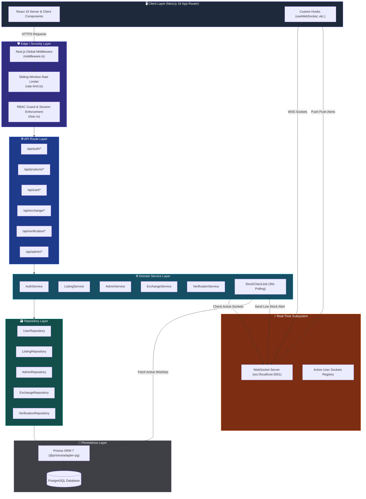
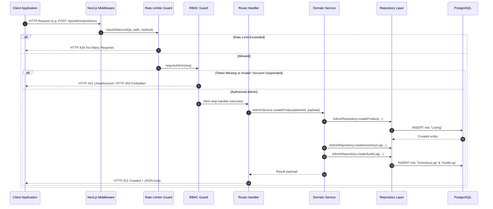
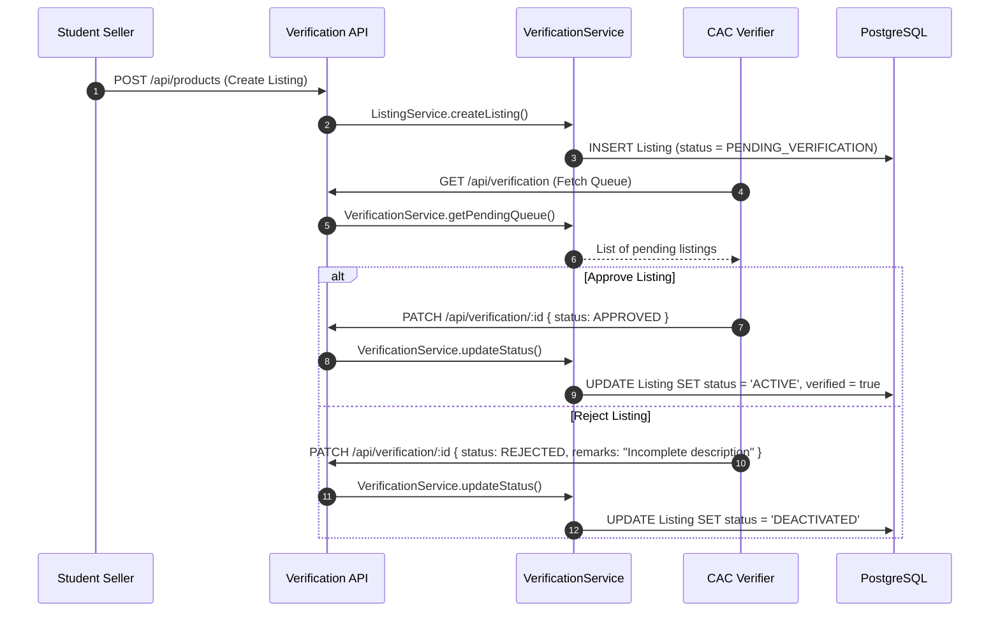

# 🏗️ Stucart — High-Level Design (HLD) Document

> **Document Version:** 1.0.0  
> **System Name:** Stucart Campus Marketplace Platform  
> **Organization:** Team-DAO  
> **Target Audience:** System Architects, Backend Engineers, DevOps, and Technical Leads

---

## 1. System Architecture Overview

Stucart is constructed using a **layered, service-oriented architecture** that decouples presentation, API routing, business domain logic, data access, and real-time event broadcasting. 

The architecture strictly adheres to separation of concerns, ensuring that security controls (rate limiting, authentication, authorization) are executed before requests hit application business logic.

---

## 2. Layer & Subsystem Breakdown

### 2.1 Edge & Security Layer
- **Global Middleware (`middleware.ts`):** Intercepts all incoming requests matching `/api/:path*`. Extracts client IP (supporting `x-forwarded-for` and `x-real-ip`) and evaluates rate limits.
- **Sliding-Window Rate Limiter (`rate-limit.ts`):** Maintains in-memory request timestamps per IP and route bucket. Returns `X-RateLimit-Limit`, `X-RateLimit-Remaining`, `X-RateLimit-Reset`, and HTTP `429` on violations.
- **RBAC Guard (`rbac.ts`):** Decodes JWT tokens, validates active session, checks account suspension (`isSuspended`), and verifies role permissions (`STUDENT`, `VERIFIER`, `ADMIN`, `SUPER_ADMIN`).

### 2.2 API & Route Handlers Layer
- Located under `src/app/api/`.
- Acts as thin HTTP controllers responsible for:
  1. Invoking RBAC guards.
  2. Parsing and validating request body/query parameters.
  3. Delegating execution to domain services.
  4. Returning standardized JSON responses and HTTP status codes (`200`, `201`, `400`, `401`, `403`, `404`, `500`).

### 2.3 Domain Service Layer
- Located under `src/backend/services/`.
- Encapsulates business logic, transactional invariants, role validation checks, and automatic side-effects (e.g., auto-updating listing status based on stock levels, creating `InventoryLog` entries, and recording `AuditLog` records).

### 2.4 Repository Layer
- Located under `src/backend/repositories/`.
- Decouples domain logic from Prisma ORM primitives.
- Provides type-safe query builders, filter constructs, paginated queries, and composite relational mutations.

### 2.5 Real-Time WebSocket Subsystem
- Located under `src/backend/websocket/server.ts` and `src/backend/services/stock-check.job.ts`.
- Runs a standalone HTTP/WebSocket server listening on port `3001`.
- **Connection Management:** Tracks active sockets with unique client IDs and associated `userId` / `userEmail`.
- **Heartbeat Protocol:** Runs 30-second ping/pong cycles to detect and terminate broken TCP connections.
- **Wishlist Stock Check Job:** A periodic worker that runs every 30 seconds, identifies active connected users, checks their wishlisted items in PostgreSQL, and pushes targeted `LOW_STOCK` or `OUT_OF_STOCK` notifications via WebSockets.

---

## 3. Data Flow & Sequence Diagrams

### 3.1 Request Execution & Defense Pipeline

### 3.2 Peer-to-Peer Product Verification Sequence

---

## 4. Key Cross-Cutting Architecture Strategies

### 4.1 Tiered Sliding-Window Rate Limiting

Rate limiting is governed by an in-memory timestamp sliding-window store:

| Bucket | Matching Condition | Limit Threshold | Window Size |
|---|---|---|---|
| **`auth`** | Endpoint begins with `/api/auth` | 10 requests | 60 seconds |
| **`mutation`** | HTTP method is `POST`, `PUT`, `DELETE`, or `PATCH` | 30 requests | 60 seconds |
| **`general`** | All standard read operations (`GET`) | 100 requests | 60 seconds |

### 4.2 Auditability & Inventory Tracking

Every write action by an administrator triggers two transactional side effects:
1. **`InventoryLog` Record:** Captures `previousStock`, `newStock`, `listingId`, `updatedById`, and timestamp whenever stock is modified.
2. **`AuditLog` Record:** Captures `adminId`, `action` (e.g. `UPDATE_USER_ROLE`, `SUSPEND_USER`, `CREATE_PRODUCT`, `DELETE_PRODUCT`), `targetType`, `targetId`, `details`, and timestamp.

### 4.3 Resilience & Fault Tolerance

- **Database Connection Pooling:** Utilizes `@prisma/adapter-pg` over `pg.Pool` to reuse database TCP sockets efficiently.
- **WebSocket Singleton Guard:** Prevents duplicate server listener bindings during Next.js Hot Module Replacement (HMR) in development environments.
