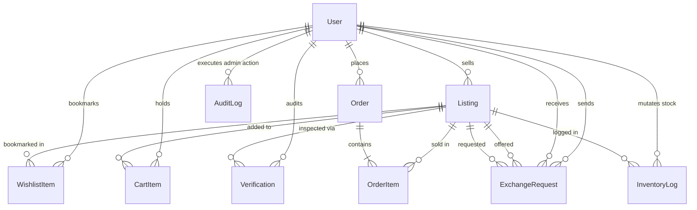

# 🔬 Stucart — Low-Level Design (LLD) Document

> **Document Version:** 1.0.0  
> **System Name:** Stucart Campus Marketplace Platform  
> **Organization:** Team-DAO  
> **Target Audience:** Software Engineers, Backend Developers, Database Administrators, and Code Reviewers

---

## 1. Database Schema & Data Dictionary

Stucart uses PostgreSQL as its primary relational store, managed via Prisma ORM 7 (`@prisma/adapter-pg`).

### 1.1 Enumerations

```prisma
enum UserRole           { STUDENT, VERIFIER, ADMIN, SUPER_ADMIN }
enum Condition          { NEW, LIKE_NEW, GOOD, FAIR, POOR }
enum ListingStatus      { ACTIVE, PENDING_VERIFICATION, SOLD, EXCHANGED, DEACTIVATED }
enum ListingType        { SALE, EXCHANGE, DONATION, RENT }
enum ExchangeStatus     { PENDING, APPROVED, REJECTED, CANCELLED }
enum VerificationStatus { PENDING, APPROVED, REJECTED }
enum OrderStatus        { PENDING, PROCESSING, SHIPPED, DELIVERED, CANCELLED, REFUNDED }
```

### 1.2 Entity Specifications

#### 1. Entity: `User`
| Field Name | Type | Constraints / Default | Description |
|---|---|---|---|
| `id` | `String` | `@id @default(uuid())` | Primary key (UUID v4) |
| `name` | `String` | Required | Full user name |
| `email` | `String` | `@unique` | Campus email address |
| `password` | `String` | Required | Hashed password (`bcryptjs`, 10 rounds) |
| `college` | `String` | Required | University / institution identifier |
| `role` | `UserRole` | `@default(STUDENT)` | Role enum (`STUDENT`, `VERIFIER`, `ADMIN`, `SUPER_ADMIN`) |
| `isSuspended` | `Boolean` | `@default(false)` | Flag indicating account suspension |
| `createdAt` | `DateTime` | `@default(now())` | Account creation timestamp |
| `updatedAt` | `DateTime` | `@updatedAt` | Account update timestamp |

#### 2. Entity: `Listing`
| Field Name | Type | Constraints / Default | Description |
|---|---|---|---|
| `id` | `String` | `@id @default(uuid())` | Primary key (UUID v4) |
| `title` | `String` | Required | Product title |
| `description` | `String` | Required | Product item description |
| `price` | `Decimal` | `@db.Decimal(10,2)` | Monetary value |
| `condition` | `Condition` | Required | Physical condition enum |
| `durationUsed` | `String?` | Optional | Duration item was used (e.g. "6 months") |
| `category` | `String` | Required | Category name (e.g., "Books", "Electronics") |
| `brand` | `String?` | Optional | Brand / Manufacturer |
| `images` | `String[]` | `@default([])` | Array of image URLs |
| `stock` | `Int` | `@default(1)` | Available quantity |
| `sellerId` | `String` | FK -> `User.id` | Foreign key referencing seller |
| `status` | `ListingStatus` | `@default(ACTIVE)` | Listing state enum |
| `listingType` | `ListingType` | `@default(SALE)` | Type enum (`SALE`, `EXCHANGE`, `DONATION`, `RENT`) |
| `exchangeAvailable` | `Boolean` | `@default(false)` | Flag indicating exchange readiness |
| `verified` | `Boolean` | `@default(false)` | CAC verification approval flag |
| `createdAt` | `DateTime` | `@default(now())` | Creation timestamp |
| `updatedAt` | `DateTime` | `@updatedAt` | Update timestamp |

*(Indexes: `@@index([sellerId])`)*

#### 3. Entity: `WishlistItem`
| Field Name | Type | Constraints / Default | Description |
|---|---|---|---|
| `id` | `String` | `@id @default(uuid())` | Primary key |
| `userId` | `String` | FK -> `User.id` | Wishlist owner |
| `listingId` | `String` | FK -> `Listing.id` | Bookmarked listing |
| `createdAt` | `DateTime` | `@default(now())` | Creation timestamp |

*(Constraints: `@@unique([userId, listingId])`, `@@index([listingId])`)*

#### 4. Entity: `CartItem`
| Field Name | Type | Constraints / Default | Description |
|---|---|---|---|
| `id` | `String` | `@id @default(uuid())` | Primary key |
| `userId` | `String` | FK -> `User.id` | Cart owner |
| `listingId` | `String` | FK -> `Listing.id` | Cart line item |
| `quantity` | `Int` | `@default(1)` | Line quantity |
| `createdAt` | `DateTime` | `@default(now())` | Creation timestamp |
| `updatedAt` | `DateTime` | `@updatedAt` | Update timestamp |

*(Constraints: `@@unique([userId, listingId])`, `@@index([listingId])`)*

#### 5. Entity: `ExchangeRequest`
| Field Name | Type | Constraints / Default | Description |
|---|---|---|---|
| `id` | `String` | `@id @default(uuid())` | Primary key |
| `senderId` | `String` | FK -> `User.id` | Initiator student |
| `receiverId` | `String` | FK -> `User.id` | Target student |
| `offeredProductId` | `String` | FK -> `Listing.id` | Product offered by sender |
| `requestedProductId` | `String` | FK -> `Listing.id` | Target product requested |
| `status` | `ExchangeStatus` | `@default(PENDING)` | Exchange state enum |
| `createdAt` | `DateTime` | `@default(now())` | Creation timestamp |
| `updatedAt` | `DateTime` | `@updatedAt` | Update timestamp |

*(Indexes: `@@index([senderId])`, `@@index([receiverId])`, `@@index([offeredProductId])`, `@@index([requestedProductId])`)*

#### 6. Entity: `Verification`
| Field Name | Type | Constraints / Default | Description |
|---|---|---|---|
| `id` | `String` | `@id @default(uuid())` | Primary key |
| `productId` | `String` | FK -> `Listing.id` | Product under review |
| `verifierId` | `String` | FK -> `User.id` | Verifier performing audit |
| `status` | `VerificationStatus` | `@default(PENDING)` | Verification outcome |
| `remarks` | `String?` | Optional | Verifier comments/reasons |
| `createdAt` | `DateTime` | `@default(now())` | Audit timestamp |
| `updatedAt` | `DateTime` | `@updatedAt` | Update timestamp |

*(Indexes: `@@index([productId])`, `@@index([verifierId])`)*

#### 7. Entity: `Order` & `OrderItem`
- `Order`: (`id`, `userId`, `totalAmount`, `status`, `createdAt`, `updatedAt`).
- `OrderItem`: (`id`, `orderId`, `listingId`, `quantity`, `price`, `createdAt`).

#### 8. Entity: `InventoryLog`
- `InventoryLog`: (`id`, `listingId`, `previousStock`, `newStock`, `updatedById`, `timestamp`).

#### 9. Entity: `AuditLog`
- `AuditLog`: (`id`, `adminId`, `action`, `targetType`, `targetId`, `details`, `timestamp`).

---

## 2. Entity-Relationship Diagram (ERD)



---

## 3. Formal State Machine Specifications

### 3.1 Listing Status Transition Matrix

| Current State | Event / Action | Next State | System Side Effects |
|---|---|---|---|
| `PENDING_VERIFICATION` | Verifier approves (`APPROVED`) | `ACTIVE` | Sets `verified = true` |
| `PENDING_VERIFICATION` | Verifier rejects (`REJECTED`) | `DEACTIVATED` | Soft-deletes listing from catalog |
| `ACTIVE` | Stock drops to 0 (`stock <= 0`) | `SOLD` | Auto-triggers wishlist WS alerts |
| `ACTIVE` | Exchange accepted | `EXCHANGED` | Decrements stock, closes pending requests |
| `SOLD` | Stock increased (`stock > 0`) | `ACTIVE` | Restores visibility in marketplace |
| `ACTIVE` / `SOLD` | Admin / Seller removes item | `DEACTIVATED` | Sets `status = DEACTIVATED` |

---

## 4. Class & Interface Specifications

### 4.1 Security & Middleware Types (`src/backend/middleware/`)

```typescript
export interface RateLimitRecord {
  timestamps: number[];
}

export interface RateLimitResult {
  allowed: boolean;
  limit: number;
  remaining: number;
  resetSeconds: number;
}

export interface AuthenticatedUser {
  id: string;
  email: string;
  name: string;
  role: UserRole;
  college: string;
  isSuspended: boolean;
}

export interface RBACResult {
  user: AuthenticatedUser | null;
  response: NextResponse | null;
}
```

### 4.2 Admin Service Class (`src/backend/services/admin.service.ts`)

```typescript
export class AdminService {
  static getDashboardOverview(): Promise<DashboardStats>;
  static getUsers(query?: UserQuery): Promise<PaginatedUsers>;
  static updateUserRole(adminId: string, targetUserId: string, newRole: UserRole): Promise<User>;
  static toggleUserSuspension(adminId: string, targetUserId: string, suspend: boolean): Promise<User>;
  static createProduct(adminId: string, data: ProductCreateDTO): Promise<Listing>;
  static updateProduct(adminId: string, productId: string, data: ProductUpdateDTO): Promise<Listing>;
  static softDeleteProduct(adminId: string, productId: string): Promise<Listing>;
  static getInventoryLogs(): Promise<InventoryLog[]>;
  static getOrders(query?: OrderQuery): Promise<Order[]>;
  static updateOrderStatus(adminId: string, orderId: string, status: OrderStatus): Promise<Order>;
  static getAuditLogs(): Promise<AuditLog[]>;
}
```

---

## 5. Core Algorithmic Details

### 5.1 In-Memory Sliding Window Rate Limiting Algorithm

```text
ALGORITHM checkRateLimit(ip, path, method):
  INPUT: client IP string, path string, method string
  OUTPUT: RateLimitResult object

  NOW = Current time in milliseconds
  WINDOW = 60,000 ms (60 seconds)

  IF path STARTS WITH "/api/auth":
    LIMIT = 10, BUCKET = "auth"
  ELSE IF method IN ["POST", "PUT", "DELETE", "PATCH"]:
    LIMIT = 30, BUCKET = "mutation"
  ELSE:
    LIMIT = 100, BUCKET = "general"

  KEY = ip + ":" + BUCKET
  RECORD = rateLimitStore.GET(KEY) OR { timestamps: [] }

  RECORD.timestamps = FILTER timestamps WHERE (NOW - timestamp < WINDOW)

  IF LENGTH(RECORD.timestamps) >= LIMIT:
    REMAINING_TIME = CEIL((RECORD.timestamps[0] + WINDOW - NOW) / 1000)
    RETURN { allowed: false, limit: LIMIT, remaining: 0, resetSeconds: REMAINING_TIME }

  PUSH NOW to RECORD.timestamps
  rateLimitStore.SET(KEY, RECORD)

  RETURN { allowed: true, limit: LIMIT, remaining: LIMIT - LENGTH(RECORD.timestamps), resetSeconds: 60 }
END ALGORITHM
```

### 5.2 Stock Check Polling Job Algorithm

```text
ALGORITHM checkActiveUserStock(prisma):
  ACTIVE_USER_IDS = getActiveUserIdsFromWebSocketConnections()
  IF ACTIVE_USER_IDS IS EMPTY:
    RETURN

  ITEMS = DB.WishlistItem.FIND_MANY(
    WHERE userId IN ACTIVE_USER_IDS,
    INCLUDE listing, user
  )

  FOR EACH item IN ITEMS:
    IF item.listing.stock > 0 AND item.listing.stock <= 2:
      ALERT = CREATE_PAYLOAD("LOW_STOCK", item.listing)
      sendToUser(item.user.id, ALERT)
    ELSE IF item.listing.stock == 0 OR item.listing.status IN ["SOLD", "EXCHANGED", "DEACTIVATED"]:
      ALERT = CREATE_PAYLOAD("OUT_OF_STOCK", item.listing)
      sendToUser(item.user.id, ALERT)
  END FOR
END ALGORITHM
```
