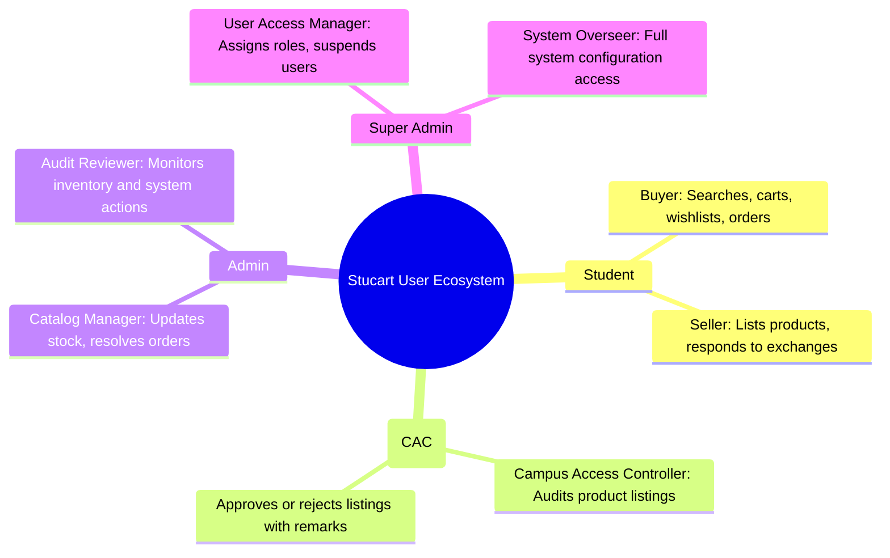
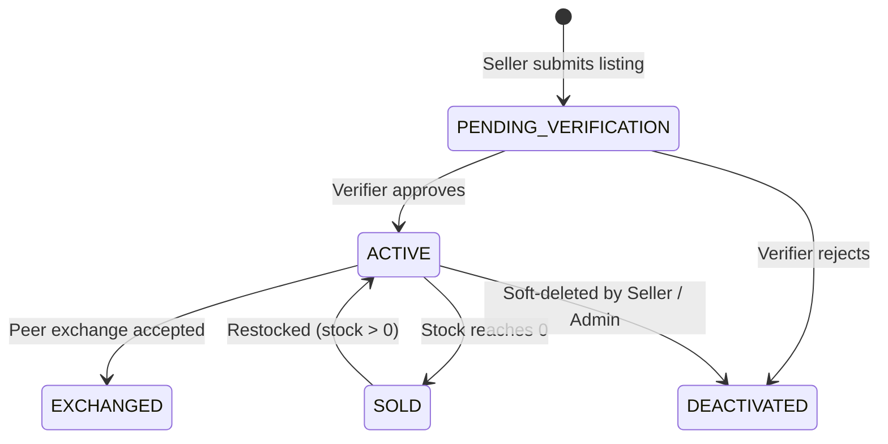
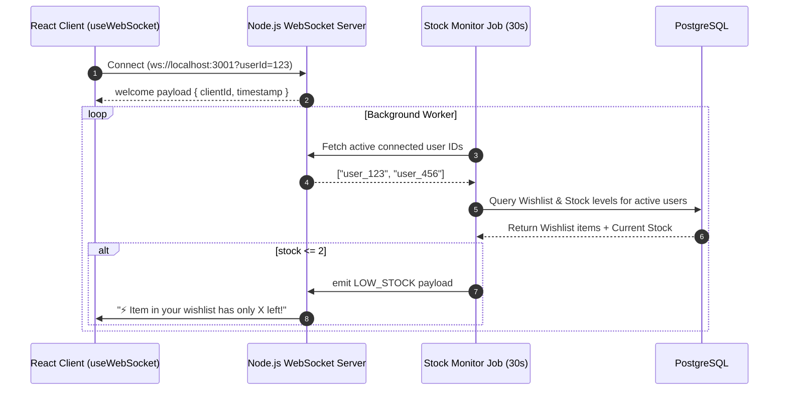

# 🎓 Stucart — Product Requirements Document (PRD)

> **Document Version:** 1.0.0  
> **Status:** Approved  
> **Author:** Team-DAO  
> **Target Audience:** Engineering, Product, UI/UX, and Campus Operations Teams

---

## 1. Executive Summary & Vision

**Stucart** is an enterprise-grade, peer-to-peer (P2P) campus marketplace and admin control platform engineered specifically for university ecosystems. It addresses the common pain points experienced by college students when buying, selling, donating, or exchanging textbooks, electronics, lab gear, and dorm essentials.

Unlike generic second-hand marketplaces, Stucart enforces **trust, safety, and operational governance** through an integrated **Campus Access Controller (CAC)** verification subsystem, real-time WebSocket stock alert notifications, sliding-window API rate limiting, and an immutable administrative audit logging infrastructure.

### 1.1 Core Mission
To provide students with a secure, instant, and trustworthy marketplace for campus transactions, while providing university administrators with complete oversight, fraud prevention, and catalog control.

---

## 2. User Personas & Roles

Stucart supports a four-tier Role-Based Access Control (RBAC) hierarchy (`STUDENT`, `VERIFIER`, `ADMIN`, `SUPER_ADMIN`).

### 2.1 Persona Definitions

| Persona | Role Enum | Key Responsibilities & Capabilities |
|---|---|---|
| **Student (Buyer/Seller)** | `STUDENT` | • Browse/search catalog with price and condition filters. • Create listings for sale, exchange, donation, or rent. • Initiate P2P exchange requests. • Manage cart, wishlist, and receive real-time low-stock alerts. |
| **CAC Verifier** | `VERIFIER` | • Inspect submitted product listings for physical authenticity. • Approve listings (moving them to `ACTIVE`) or reject them with detailed feedback/remarks. |
| **Marketplace Admin** | `ADMIN` | • Monitor real-time system metrics via the Admin Console. • Manage product catalog stock and status. • Process order status changes (`PENDING` → `PROCESSING` → `SHIPPED` → `DELIVERED`). |
| **Super Admin** | `SUPER_ADMIN` | • Promote or demote user roles. • Suspend/activate accounts. • Access complete, unalterable system audit logs. |

---

## 3. Product Features & Functional Requirements

### 3.1 Authentication & Access Control

- **FR-AUTH-01 (Registration & Login):** Users must register with a valid college email address. Passwords must be securely hashed using `bcryptjs` (salt rounds: 10).
- **FR-AUTH-02 (Session Handling):** Authentication is stateless via JSON Web Tokens (JWT) carried in `Authorization: Bearer <token>` or HTTP-only cookies.
- **FR-AUTH-03 (Account Suspension Guard):** Suspended users (`isSuspended = true`) are immediately rejected at the RBAC layer with HTTP `403 Forbidden` across all protected routes.

### 3.2 Product Catalog & Peer-to-Peer Listings

- **FR-CAT-01 (Multi-Type Support):** Sellers can list items across four listing types: `SALE`, `EXCHANGE`, `DONATION`, and `RENT`.
- **FR-CAT-02 (Condition Grading):** Listings must specify condition level (`NEW`, `LIKE_NEW`, `GOOD`, `FAIR`, `POOR`) and optional usage duration (e.g., "1 semester", "2 years").
- **FR-CAT-03 (Automated Stock & Status Lifecycle):**
  - New listings enter `PENDING_VERIFICATION` (or `ACTIVE` if self-verified).
  - Stock drops to 0 automatically transition status to `SOLD`.
  - Restocking above 0 transitions status back to `ACTIVE` (unless manually `DEACTIVATED`).

### 3.3 Peer-to-Peer Exchange Subsystem

- **FR-EXCH-01 (Exchange Offer):** Students can offer one of their active products in exchange for another user's requested item.
- **FR-EXCH-02 (Status Workflow):** Exchange requests support states `PENDING`, `APPROVED`, `REJECTED`, and `CANCELLED`.
- **FR-EXCH-03 (Inventory Lock):** Upon approval of an exchange, both products transition to `EXCHANGED` status and stock is decremented accordingly.

### 3.4 Campus Access Controller (CAC) Verification Workflow

- **FR-VER-01 (Verification Workspace):** Verifiers access a dedicated `/verify` queue containing all items marked `PENDING_VERIFICATION`.
- **FR-VER-02 (Audit & Feedback):** Verifiers inspect physical condition photos, seller details, and approve or reject the item, recording mandatory remarks for rejected items.

### 3.5 Real-Time WebSocket Alerts & Notification Engine

- **FR-WS-01 (Persistent Socket Connection):** Connected clients maintain a persistent WebSocket channel on `ws://localhost:3001` with automated heartbeat pings every 30 seconds.
- **FR-WS-02 (Low Stock Push Alerts):** A background stock monitor polls active user wishlists every 30 seconds:
  - If a wishlisted item has `1 <= stock <= 2`, send `LOW_STOCK` alert ("Hurry! Almost Sold Out ⚡").
  - If a wishlisted item has `stock == 0` or status `SOLD`, send `OUT_OF_STOCK` alert ("Item Sold Out 🚫").

### 3.6 Enterprise Admin Control Console

- **FR-ADM-01 (Dashboard KPI Analytics):** Real-time aggregate statistics for total revenue, active listings, pending verifications, total users, and total orders.
- **FR-ADM-02 (User Governance):** Search, filter, role promotion (`STUDENT` → `VERIFIER` → `ADMIN` → `SUPER_ADMIN`), and account suspension toggle.
- **FR-ADM-03 (Inventory & Catalog Management):** Global product creation, stock adjustment, soft deletion (`DEACTIVATED`), and automated inventory logging (`InventoryLog`).
- **FR-ADM-04 (Order Fulfillment):** Manage order lifecycle (`PENDING` → `PROCESSING` → `SHIPPED` → `DELIVERED` → `CANCELLED`).
- **FR-ADM-05 (System Audit Logging):** Every administrative mutation creates an immutable `AuditLog` entry detailing `adminId`, `action`, `targetType`, `targetId`, and JSON timestamp.

---

## 4. Non-Functional Requirements (NFRs)

| Category | Requirement Specification |
|---|---|
| **Security** | • Hashing: `bcryptjs` with 10 salt rounds. • Bearer JWT validation on every protected API route. • Protection against XSS, SQL injection (handled via Prisma parameterized queries), and CSRF. |
| **Performance** | • API response times < 150ms for P95 cached queries. • In-memory sliding-window rate limiter per client IP:   - Auth endpoints: 10 req/min   - Mutations (`POST`/`PUT`/`PATCH`/`DELETE`): 30 req/min   - Reads (`GET`): 100 req/min |
| **Reliability** | • Database connection pooling via `@prisma/adapter-pg`. • Graceful handling of WebSocket port collisions and client auto-reconnection. |
| **Scalability** | • Decoupled WebSocket engine capable of horizontal expansion via Redis Pub/Sub. • Database indexes on frequently queried fields (`sellerId`, `userId`, `listingId`, `status`). |

---

## 5. Success Metrics & KPIs

1. **User Engagement:** Daily Active Users (DAU), average time to list an item (< 2 minutes).
2. **Transaction Velocity:** Percentage of listings sold or exchanged within 7 days of posting.
3. **Verification Efficiency:** Average time taken by CAC verifiers to process pending listings (< 4 hours).
4. **Platform Security:** 0 unauthorized role escalations, 100% audit log capture rate for admin actions.
