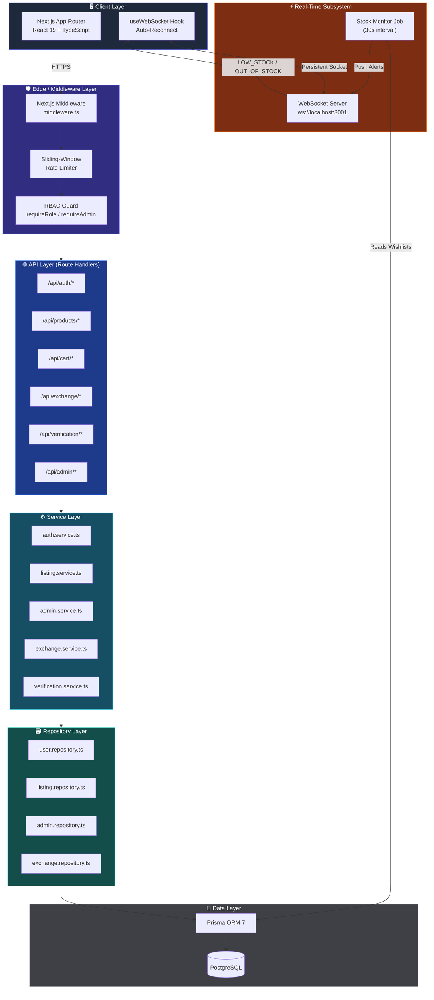
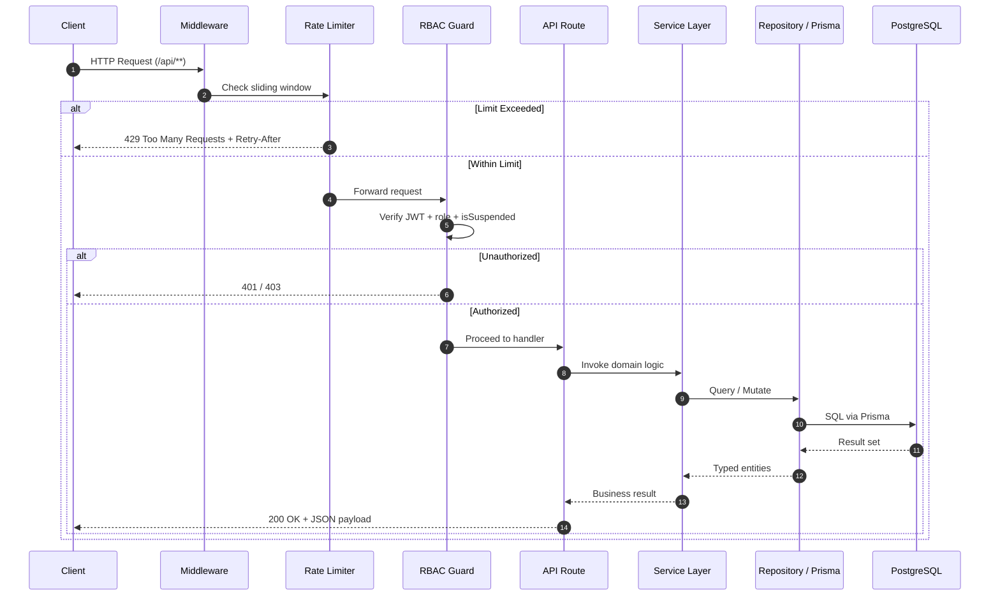
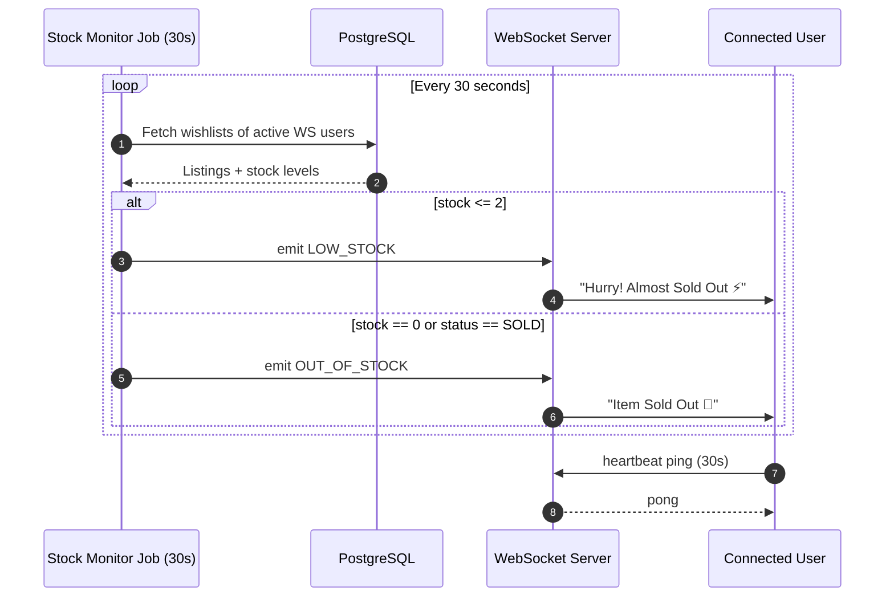
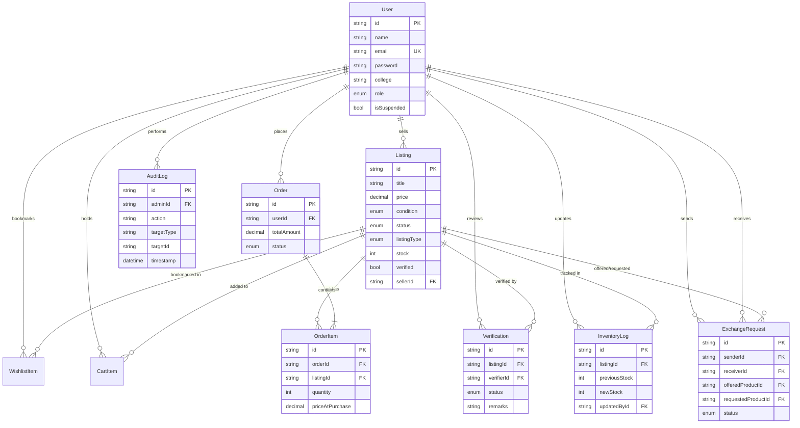
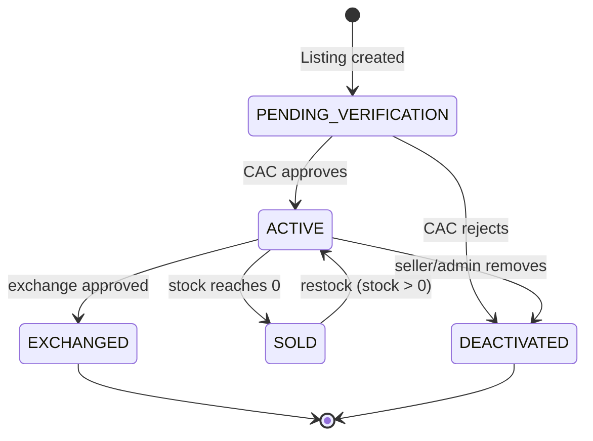
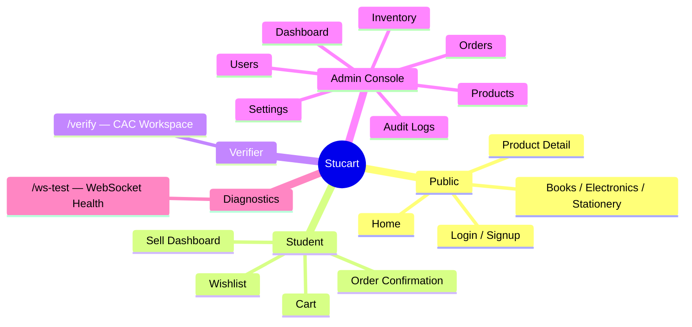

<div align="center">

# 🎓 Stucart

### Enterprise-Grade Campus Peer-to-Peer Marketplace & Admin Control Platform

*Buy. Sell. Exchange. Verify. In real time.*

[](https://nextjs.org/)
[](https://react.dev/)
[](https://www.typescriptlang.org/)
[](https://www.prisma.io/)
[](https://www.postgresql.org/)
[](https://tailwindcss.com/)
[](https://github.com/websockets/ws)
[](#-license)

[Overview](#-overview) • [Architecture](#-system-architecture) • [Tech Stack](#-technology-stack) • [Data Model](#-data-model) • [Getting Started](#-getting-started) • [API Reference](#-api-reference) • [Security](#-security--reliability)

</div>

---

## 📖 Overview

**Stucart** (developed under the **Team-DAO** organization) is a full-stack, production-grade **campus marketplace platform** that enables students to **buy, sell, exchange, or donate** textbooks, electronics, stationery, and dorm essentials — backed by an institutional-grade **Admin Control Console**.

The platform combines a modern **Next.js 16 / React 19** frontend with a robust **Node.js + PostgreSQL** backend, layered with:

- 🔐 **JWT authentication** with **Role-Based Access Control (RBAC)**
- 🧑‍💼 **Campus Access Controller (CAC)** product verification workflow
- ⚡ **Real-time WebSocket** stock alerts and notifications
- 🛡️ **Sliding-window rate limiting** across all API surfaces
- 📊 A full **Admin Console** — user management, inventory audits, order tracking, and system-wide audit logging

> Built with the same engineering rigor expected of production systems at scale: layered architecture, transactional integrity, observability via audit trails, and defense-in-depth security.

---

## 🏗️ System Architecture

Stucart follows a **layered, service-oriented architecture** separating concerns across presentation, API, business logic, data access, and real-time subsystems.



### Request Lifecycle

Every API request flows through a strict pipeline of **rate limiting → authentication → authorization → business logic → persistence**, guaranteeing consistent security enforcement regardless of endpoint.



### Real-Time Stock Alert Pipeline



---

## 🧰 Technology Stack

<table>
<tr><th>Layer</th><th>Technology</th><th>Purpose</th></tr>
<tr><td><b>Frontend Framework</b></td><td>Next.js 16 (App Router), React 19, TypeScript</td><td>SSR/CSR hybrid rendering, type-safe UI</td></tr>
<tr><td><b>Styling</b></td><td>Tailwind CSS v4, Framer Motion</td><td>Glassmorphism design system & micro-interactions</td></tr>
<tr><td><b>Icons</b></td><td>Lucide React</td><td>Consistent iconography</td></tr>
<tr><td><b>Database</b></td><td>PostgreSQL + Prisma ORM 7 (<code>@prisma/adapter-pg</code>)</td><td>Relational integrity, type-safe queries</td></tr>
<tr><td><b>Real-Time</b></td><td>Node.js <code>ws</code> WebSocket Server</td><td>Live stock alerts & connection tracking</td></tr>
<tr><td><b>Auth</b></td><td>JWT (<code>jsonwebtoken</code>), <code>bcryptjs</code></td><td>Stateless auth & secure password hashing</td></tr>
<tr><td><b>Security</b></td><td>Custom sliding-window rate limiter, RBAC middleware</td><td>Abuse prevention & access control</td></tr>
</table>

---

## 🗄️ Data Model



### Listing Lifecycle State Machine



---

## 🔐 Security & Reliability

| Control | Implementation |
|---|---|
| **Password Storage** | `bcryptjs` hashing, 10 salt rounds |
| **Session/Auth** | Stateless JWT (Bearer header / HttpOnly cookie) |
| **Authorization** | RBAC guards — `requireRole`, `requireAdmin`, `requireSuperAdmin` |
| **Abuse Prevention** | Sliding-window rate limiter (per-IP, tiered by route sensitivity) |
| **Account Safety** | `isSuspended` flag enforced at the RBAC layer on every request |
| **Auditability** | Immutable `AuditLog` + `InventoryLog` tables for all sensitive mutations |
| **Data Integrity** | Prisma-enforced relational constraints & unique composite keys (e.g., `@@unique([userId, listingId])`) |

### Rate Limiting Tiers

| Route Class | Limit | Window |
|---|---|---|
| `POST /api/auth/*` | 10 requests | 60s |
| Mutations (`POST`/`PUT`/`PATCH`/`DELETE`) | 30 requests | 60s |
| Reads (`GET`) | 100 requests | 60s |

Exceeding a threshold returns `429 Too Many Requests` with `X-RateLimit-*` and `Retry-After` headers.

---

## 🌐 API Reference

<details>
<summary><b>Authentication</b></summary>

| Method | Endpoint | Description |
|---|---|---|
| `POST` | `/api/auth/register` | Register a new user account |
| `POST` | `/api/auth/login` | Authenticate and issue JWT |
| `GET` | `/api/auth/me` | Fetch current session user |

</details>

<details>
<summary><b>Marketplace</b></summary>

| Method | Endpoint | Description |
|---|---|---|
| `GET` | `/api/products` | Search/filter listings |
| `GET` | `/api/products/[id]` | Fetch single listing |
| `POST` | `/api/products` | Create a listing |
| `GET` | `/api/cart` | Retrieve cart contents |
| `POST` | `/api/cart` | Add item to cart |
| `DELETE` | `/api/cart/[id]` | Remove cart line item |
| `GET` | `/api/wishlist` | Retrieve wishlist |
| `POST` | `/api/wishlist/[id]` | Toggle wishlist item |

</details>

<details>
<summary><b>Exchange & Verification</b></summary>

| Method | Endpoint | Description |
|---|---|---|
| `POST` | `/api/exchange` | Create swap request |
| `PATCH` | `/api/exchange/[id]` | Approve / reject / cancel |
| `GET` | `/api/verification` | CAC verifier queue |
| `PATCH` | `/api/verification/[id]` | Approve/reject with remarks |

</details>

<details>
<summary><b>Admin Console</b></summary>

| Method | Endpoint | Description |
|---|---|---|
| `GET` | `/api/admin/dashboard` | System metrics & KPIs |
| `GET`/`PATCH` | `/api/admin/products` | Manage catalogue & stock |
| `GET` | `/api/admin/inventory` | Inventory change history |
| `GET`/`PATCH` | `/api/admin/orders` | Order management |
| `GET`/`PATCH` | `/api/admin/users` | Role promotion & suspension |
| `GET` | `/api/admin/audit-logs` | Full audit trail |

</details>

---

## 🖥️ Application Map



---

## 🚀 Getting Started

### Prerequisites
- Node.js ≥ 20
- PostgreSQL ≥ 15
- npm / pnpm / yarn

### Installation

```bash
# 1. Clone the repository
git clone https://github.com/Team-DAO/stucart.git
cd stucart

# 2. Install dependencies
npm install

# 3. Configure environment variables
cp .env.example .env
# Set DATABASE_URL, JWT_SECRET, WS_PORT, etc.

# 4. Run database migrations
npx prisma migrate dev

# 5. Seed sample data (users, listings, orders, audit logs)
npx prisma db seed

# 6. Start the WebSocket server
npm run ws:server

# 7. Start the Next.js app
npm run dev
```

The app will be available at `http://localhost:3000`, and the WebSocket server at `ws://localhost:3001`.

### Seeded Accounts

| Role | Email | Notes |
|---|---|---|
| Super Admin | `superadmin@college.edu` | Full system access |
| Admin | `admin@college.edu` | Standard admin |
| Verifier | seeded ×2 | CAC verification queue |
| Student | seeded ×4 | Buyer/seller accounts |

---

## 🧪 Testing

```bash
# Auto stock-status transition tests
npx ts-node src/backend/test-sold-out.ts

# RBAC / JWT / metrics integration tests
npx ts-node src/backend/test-admin-rbac.ts
```

---

## 📂 Project Structure

```
Team-DAO/
├── prisma/
│   ├── schema.prisma        # Data model & enums
│   └── seed.ts               # Database seeder
├── src/
│   ├── app/
│   │   ├── (frontend)/       # Public + role-based pages
│   │   └── api/               # Route handlers
│   ├── backend/
│   │   ├── middleware/        # RBAC, rate limiting
│   │   ├── repositories/      # Data access layer
│   │   ├── services/          # Business logic
│   │   ├── websocket/         # Real-time server
│   │   └── utils/             # Auth, helpers
│   └── frontend/
│       ├── components/        # UI component library
│       ├── hooks/              # useWebSocket, etc.
│       └── shared/              # Types & validators
└── middleware.ts               # Global Next.js middleware
```

---

## 🗺️ Roadmap

- [ ] Payment gateway integration (Stripe/Razorpay)
- [ ] Image upload to object storage (S3-compatible)
- [ ] Push notifications via web push / FCM
- [ ] GraphQL gateway for mobile clients
- [ ] Horizontal scaling of WebSocket layer (Redis pub/sub)

---

## 📄 License

Distributed under the **MIT License**. See `LICENSE` for details.

---

<div align="center">

Built with ⚙️ engineering discipline by **Team-DAO**

</div>